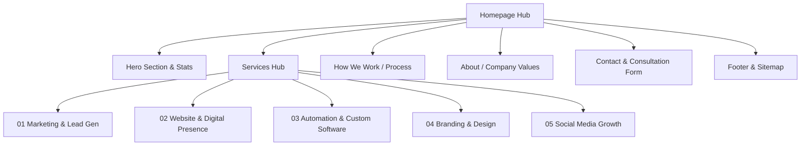

# Product Requirements Document (PRD)
## Project: OPIL Tech Solutions Corporate Website

---

## 1. Executive Summary
**OPIL Tech Solutions** (formerly Onepage Info India Pvt. Ltd.) is a specialist business consultancy and technology provider. The goal is to build a simple, clean, and highly professional corporate portfolio website that clearly communicates our 5 core service offerings, builds enterprise credibility, and drives conversions (consultation bookings and inquiries).

The design will draw structural and aesthetic inspiration from:
- **[Bizinso](https://www.bizinso.com/)**: For clean service categorizations, linear process layouts, and modern B2B tech aesthetics.
- **[QTech Software](https://www.qtechsoftware.com/)**: For professional typography, hierarchy, structured navigation, and trustworthy enterprise presentation.

---

## 2. Brand Identity & Visual Design System

### 2.1 Color Palette
The website will utilize a structured modern design system based on the official brand colors:

| Color Name | Hex Code | Purpose / Application |
| :--- | :--- | :--- |
| **Black** | `#000000` | Primary text, dark backgrounds, high-contrast sections |
| **White** | `#FFFFFF` | Core background, card backgrounds, light sections |
| **Orange (Search)** | `#FF6A00` | Primary action buttons (CTAs), highlights, focus states |
| **Violet (Express)** | `#8B5CF6` | Secondary accent, gradients, service categories |
| **Green (Grow)** | `#00C853` | Trust badges, success messages, metrics/stats highlights |
| **Muted Gray** | `#F8F9FA` | Neutral background for sections, card borders, hover states |

### 2.2 Logo Specification
The logo is represented by **OPIL TECH SOLUTIONS** with a vibrant, modern gradient:
- **Gradient Flow**: Orange $\rightarrow$ Magenta $\rightarrow$ Violet $\rightarrow$ Blue $\rightarrow$ Cyan.
- **Slogan**: "— TECH SOLUTIONS —" integrated below.
- **Implementation**: The logo will be rendered as a custom **inline SVG** to ensure it remains perfectly sharp, vector-based, lightweight, and responsive across all device sizes.

### 2.3 Typography & Grid
- **Primary Font**: `Inter` or `Outfit` (loaded via Google Fonts) for a modern, sleek sans-serif appearance.
- **System fallback**: `system-ui, -apple-system, sans-serif`.
- **Layout Grid**: 12-column grid system with a maximum content width of `1280px` for optimal readability and modern layout margins.

---

## 3. Site Structure & Pages

The site will be structured as a high-converting, single-page application (or multi-page ready structure) with smooth scrolling and dynamic interactive panels to keep it fast, simple, and professional.

### 3.1 Key Sections Detailed

#### A. Header & Navigation Bar
- **Logo**: SVG logo linking to homepage.
- **Links**: About Us, Services, Process, Contact.
- **Call-to-Action Button**: "Book Consultation" (prominently styled in Orange).
- **Mobile Menu**: Responsive hamburger menu with smooth toggle transition.

#### B. Hero Section (Value Proposition)
- **Headline**: "Consultancy Built to Grow Every Part of Your Business"
- **Subheadline**: "From lead generation to web development, brand identity to business automation — we partner with you to deliver real, measurable results."
- **CTAs**: 
  - Primary button: "Book a Free Consultation" (Orange background, hover micro-animation)
  - Secondary text link: "Call +91 93728 30269" with telephone handler (`tel:`)
- **Key Metrics / Trust Badges Grid**:
  - **500+** Projects Delivered
  - **98%** Client Satisfaction
  - **21** Specialist Services
  - **7+** Years Experience

#### C. Services Showcase (The 5 Service Pillars)
To prevent cognitive overload, the 21 services will be displayed in an interactive, clean **tabbed interface** or a **grid layout with filter tabs** (Marketing, Website, Automation, Branding, Social Media), modeled after Bizinso's categorizations.

*   **01 Marketing & Lead Generation**:
    - Help Center, Landing Pages, Lead Automation, Paid Ads, SEO.
*   **02 Website & Digital Presence**:
    - Landing Pages Design, SEO Optimization, Website Development, Website Maintenance.
*   **03 Business Automation & Software**:
    - CRM Development, Custom Applications, ERP Solutions, HRMS Systems.
*   **04 Branding & Graphic Design**:
    - Design Templates, Logo & Brand Identity, Marketing Creatives, Social Media Design.
*   **05 Social Media Growth & Management**:
    - Ad Campaigns, Content Management, Performance Reporting, Social Posting.

#### D. The Engagement Process ("How We Work")
Inspired by Bizinso's "Plan $\rightarrow$ Design $\rightarrow$ Build" flow, this section builds trust by detailing the engagement path:
1. **Consultation**: Discover bottlenecks and draft a tailored strategy.
2. **Design & Plan**: Create UX/UI wireframes, architecture plans, and timelines.
3. **Build & Automate**: Fast development with continuous feedback loops.
4. **Optimize & Grow**: Drive traffic, capture leads, and scale systems.

#### E. About & Company Overview
- Simple text introduction explaining the values, origin, and commitment to client success.

#### F. Contact & Inquiry Section
- Fully interactive form: Name, Email, Phone, Services Needed (dropdown multiselect), and Message.
- Contact details card: Address, Direct Call Number, Email support.

#### G. Footer
- Links to Legal pages (Terms, Privacy, Refund, Cookies, Disclaimer).
- Sitemap reference, copyright notice, social links.

---

## 4. Technical Specifications & SEO

### 4.1 Tech Stack
- **Structure**: Semantic HTML5 (header, section, nav, main, footer).
- **Styling**: Vanilla CSS3, structured with CSS custom properties (variables) for theme control.
- **Logic**: Vanilla ES6+ JavaScript for interactive tabs, mobile menu toggles, and form validation. No heavy external frameworks for maximum performance.

### 4.2 Performance & Accessibility
- **CSS Transitions**: All hover effects will use `transition: all 0.3s ease;` to create a smooth, premium feel.
- **Lazy Loading**: Native browser lazy loading for any images.
- **Responsive**: Fully responsive CSS media queries starting from `320px` to `1920px` widths.
- **SEO Elements**: Correct heading structure (one `<h1>`), meta description, open graph tags, descriptive image `alt` attributes, and search engine readable semantic markup.

---

## 5. Next Steps & Approval Gate

1. **Review and Approval**: The user reviews this PRD and provides feedback.
2. **Implementation Plan Approval**: Approve the implementation steps (file creation, layout design, code drafting).
3. **Execution**: Creating the HTML, CSS, and JS files, importing assets, and rendering the final interactive UI.
4. **Verification**: Live preview and responsive checks.
